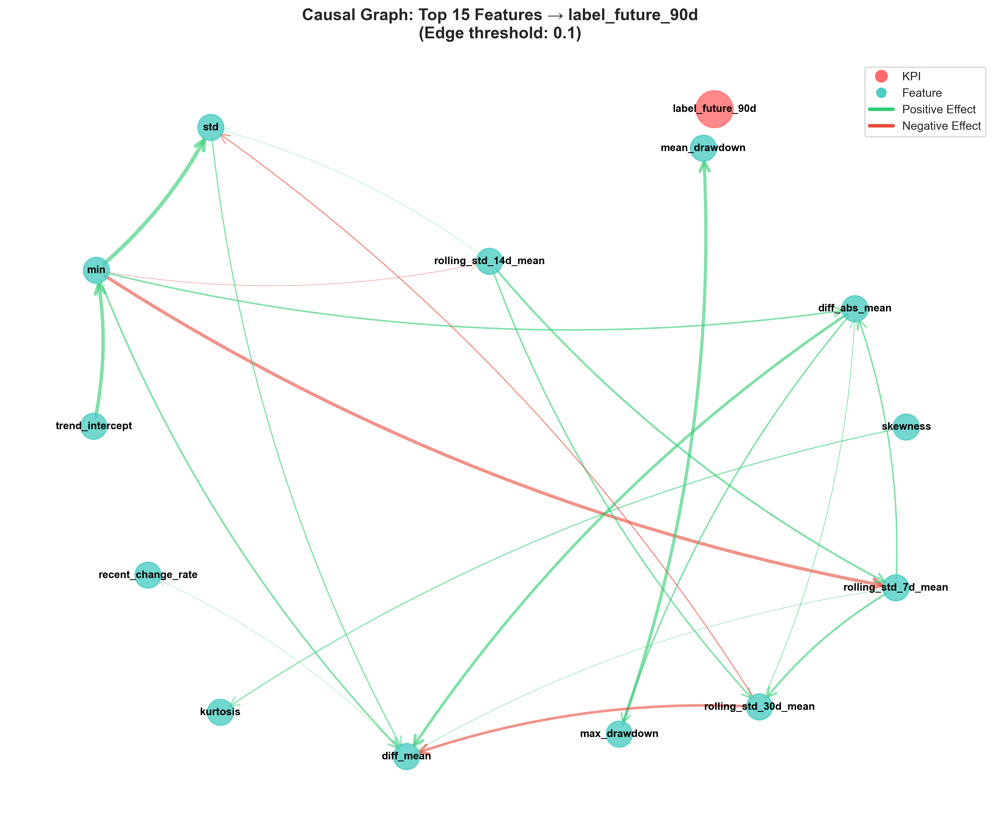
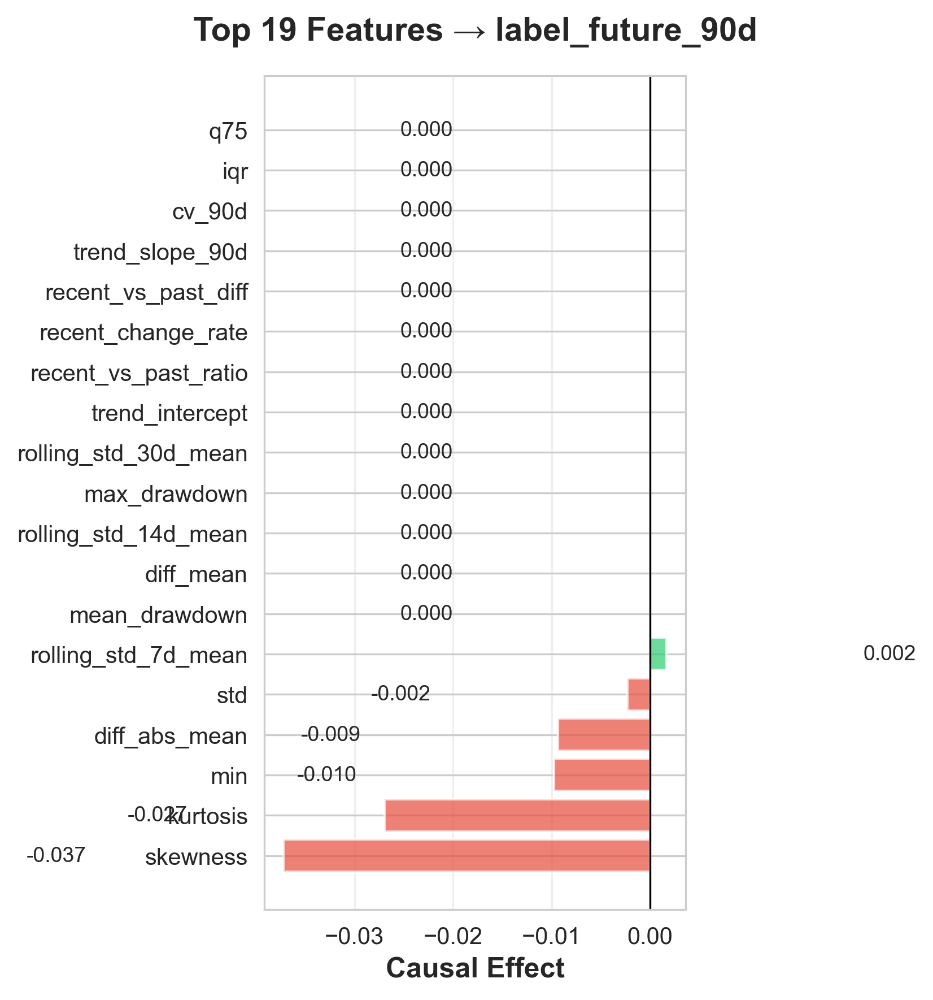
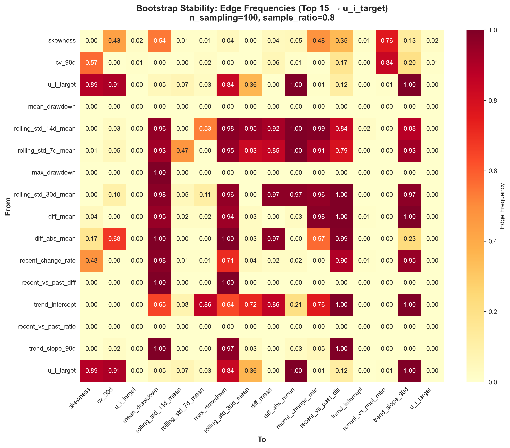

# Pump Equipment LiNGAM Causal Discovery MVP v0.1.0

[日本語版 / Japanese Version](README_JP.md)

## Overview

An MVP system for feature engineering and causal discovery for pump equipment. Generates 22 features from 90-day measurement data and discovers causal relationships to anomaly prediction using LiNGAM (Linear Non-Gaussian Acyclic Model).

We analyzed 650 days (2024/3/6 - 2025/12/17) of measurement data from 64 pump equipment units and quantified causal effects on 90-day-ahead anomaly prediction (label_future_90d).

## Project Structure

```
feature_eng_cause_lingam/
├── data/
│   ├── processed/          # Processed data
│   │   ├── labeled_time_series.csv
│   │   └── selected_64_equipment.json
│   └── data_source/        # Raw data
├── src/                    # Source code
│   ├── data_preprocessing.py      # Data preprocessing
│   ├── feature_engineering.py     # Feature generation
│   ├── causal_discovery.py        # LiNGAM causal discovery
│   ├── visualization.py           # Visualization
│   └── validation.py              # Bootstrap validation
├── output/                 # Output files
├── config.yaml            # Configuration file
├── requirements.txt       # Dependencies
└── main.py               # Main pipeline

```

## Setup

```bash
# Install dependencies
pip install -r requirements.txt
```

## Usage

```bash
# Run entire pipeline
python main.py

# Run individual steps
python main.py --step preprocessing
python main.py --step feature_engineering
python main.py --step causal_discovery
python main.py --step visualization
python main.py --step validation
```

## Output Files

- `output/features_90d.csv` - Generated feature matrix
- `output/scaled_features.csv` - Scaled features
- `output/causal_results.pkl` - LiNGAM estimation results
- `output/causal_graph.png` - Causal graph visualization
- `output/kpi_effects.csv` - KPI causal effects
- `output/bootstrap_stability_heatmap.png` - Bootstrap stability heatmap

## Technical Specifications

- **Equipment**: 64 pump units
- **Data Period**: 2024/3/6 ~ 2025/12/17 (650 days, 92,861 records)
- **Check Items**: 229 items
- **Time Window**: 90-day rolling window
- **Features**: 22 (11 statistical, 5 trend, 6 variability)
- **KPI**: label_future_90d (90-day-ahead anomaly prediction)
- **Causal Discovery**: DirectLiNGAM
- **Validation**: Bootstrap (100 iterations, 80% subsampling)
- **Parallel Processing**: 10 cores (joblib.Parallel)

## Results

### Causal Discovery Results

DirectLiNGAM discovered **139 causal relationships** (non-zero edges), with **109 stable edges** (frequency ≥70%) identified through bootstrap validation.

#### Key Causal Effects on KPI

| Rank | Feature | Causal Effect | Interpretation |
|------|---------|---------------|----------------|
| 1 | skewness | -0.0372 | Higher skewness decreases anomaly prediction |
| 2 | kurtosis | -0.0270 | Higher kurtosis decreases anomaly prediction |
| 3 | min | -0.0097 | Lower minimum values decrease anomaly prediction |
| 4 | diff_abs_mean | -0.0094 | Higher absolute differences decrease anomaly prediction |
| 5 | std | -0.0023 | Higher standard deviation decreases anomaly prediction |
| 6 | rolling_std_7d_mean | +0.0017 | Higher short-term variability increases anomaly prediction |


*Figure 1: Causal graph of top 15 features to KPI (edge width proportional to effect magnitude)*


*Figure 2: Heatmap of causal effects between features and to KPI*

### Bootstrap Validation Results

100 bootstrap sampling iterations (80% subsampling) evaluated the stability of the causal structure.

**Top 10 Stable Edges** (frequency ≥70%):

| From | To | Frequency | Mean Effect |
|------|-----|-----------|-------------|
| rolling_std_30d_mean | trend_slope_90d | 0.97 | 1.86 |
| median | mean | 1.00 | 1.75 |
| min | std | 1.00 | 1.07 |
| min | rolling_std_7d_mean | 1.00 | -0.95 |
| trend_slope_90d | recent_vs_past_diff | 1.00 | 0.93 |


*Figure 3: Causal relationship stability from bootstrap validation (color intensity = frequency)*


*Figure 4: Stability of causal effects to KPI (error bars = bootstrap standard deviation)*

## Key Findings

### 1. Distribution Shape Anomalies as Key Predictors

The strongest negative causal effects from skewness and kurtosis suggest that **deviation from normality in data distribution signals anomaly precursors**. High kurtosis or skewness indicates equipment operating outside normal ranges, potentially leading to future anomalies.

### 2. Minimum Value Decline Impacts Anomaly Prediction

The negative effect of `min` indicates that declining minimum values (e.g., abnormally low pressure or flow rate) contribute to 90-day-ahead anomaly prediction. This likely captures **equipment performance degradation patterns**.

### 3. Contrasting Effects of Short-term vs Long-term Variability

`rolling_std_7d_mean` shows positive effect while `std` shows negative effect. This suggests **short-term variability increases serve as early warning signals**, while long-term high variability has different associations with anomaly prediction.

### 4. High Causal Structure Stability

Bootstrap validation identified 109 stable edges (frequency ≥70%). Basic statistical relationships like median→mean and min→std appeared at 100% frequency, confirming the **robustness of data-driven causal structure discovery**.

### 5. Practical Feasibility with Parallel Processing

10-core parallel processing completed feature engineering (229 groups) in 1.2 minutes and bootstrap validation (100 iterations) in 28.9 minutes, enabling **periodic retraining in production environments**.

## Future Directions

1. **Different KPI Periods**: Compare causal relationships for 30-day and 60-day-ahead predictions to analyze how feature importance changes with prediction horizon
2. **Physical Interpretation**: Validate physical plausibility of discovered causal relationships with domain experts
3. **Causal Effect Utilization**: Build anomaly prediction models using identified causal features
4. **Real-time Monitoring**: Develop early warning systems based on thresholds for top causal features

## Feature List

### Statistical Features (11)
- mean, std, min, max, median
- q25, q75, iqr
- skewness, kurtosis
- cv_90d (coefficient of variation)

### Trend Features (5)
- trend_slope_90d (90-day trend slope)
- trend_intercept (intercept)
- recent_vs_past_ratio (recent/past ratio)
- recent_vs_past_diff (recent-past difference)
- recent_change_rate (rate of change)

### Variability Features (6)
- diff_mean (difference mean)
- diff_abs_mean (absolute difference mean)
- rolling_std_7d/14d/30d_mean (rolling standard deviations)
- max_drawdown (maximum drawdown)
- mean_drawdown (mean drawdown)

## License

Apache License 2.0 - See [LICENSE](LICENSE) file for details.

## Version History

### v0.1.0 (2026-05-16)
- Initial release
- DirectLiNGAM causal discovery implementation
- Causal effect analysis of 22 features for 90-day KPI
- Bootstrap validation for stability assessment
- 10-core parallel processing optimization

## Additional Documentation

- [Lesson_KPI_Cause.md](Lesson_KPI_Cause.md) - Comparative analysis across different KPI prediction periods (30-day, 60-day, 90-day)
- [README_JP.md](README_JP.md) - Japanese version of this README

## Citation

If you use this code in your research, please cite:

```bibtex
@software{pump_causal_discovery_2026,
  title = {Pump Equipment LiNGAM Causal Discovery MVP},
  author = {Pump Equipment Causal Discovery Project},
  year = {2026},
  version = {0.1.0},
  license = {Apache-2.0}
}
```

## Contact

For questions and feedback, please open an issue in the repository.
